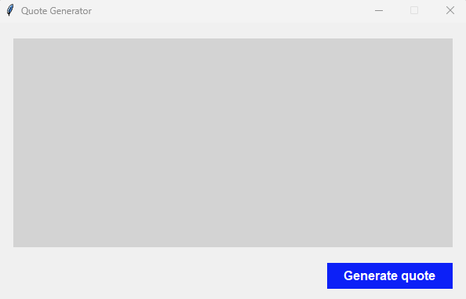
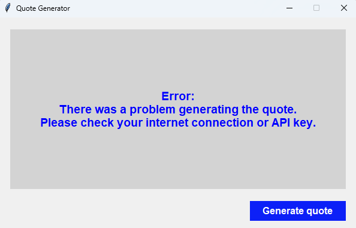

# Tk Quote Generator

A simple and lightweight Tkinter-based **Quote Generator** that fetches inspiring quotes from the **Quotable API**, featuring a clean UI and easy one-click functionality.


## ⭐ Features

- Built with Tkinter (no external GUI libraries required)
- Fetches real-time quotes from the Quotable API
- Clean and compact user interface
- One-click quote generation
- Beginner-friendly Python GUI project
- Works on Windows, macOS, and Linux


## 🖼 Preview

Here are some screenshots of the `Tk Quote Generator` project:

**Main Page with Dark Mode**<br/>
<br/>
**Output Page with Light Mode**<br/>



## 🛠 Technologies Used

- **Requests**
- **Tkinter**
- **Quotable.io API**

### Development Environment

This project was developed using:

- **Operating Systems:**  
  - Windows 11
  - Kali Linux 2025.2

- **Software:**  
  - Python 3.11
  - Visual Studio Code


## 📦 Installation

### 1. Clone the Repository  
```bash
git clone https://github.com/iamx-ariful-islam/Tk-Quote-Generator.git
cd Tk-Quote-Generator
```

### 2. Install Dependencies

Make sure `pip` is available in your system PATH.

```bash
pip install -r requirements.txt
# or (Linux/MacOS)
sudo pip install -r requirements.txt
```
The `requirements.txt` file, lists of all the python libraries that my "**_CTk Quote Generator_**" depends on and installs those packages from the file.

### 3. Run the Application
```bash
python main.py
```


## 📁 Project Structure
Here’s the structure of the **Tk Quote Generator** project:

```bash
Tk-Quote-Generator/
│
│── screenshots/
│── main.py
│── LICENSE
├── README.md
└── requirements.txt
```


## 🌐 API Used
This project uses the Quotable API:
**`https://api.quotable.io/random`**


## 💡 How It Works

1. Click Generate Quote → The app calls the Quotable API
1. The app parses the JSON response
1. The quote and author are displayed in the text box
1. Users can copy/paste text via right-click menu
1. Appearance can be toggled between Light/Dark


## 🤝 Contributing

Contributions, suggestions, and feedback are always welcome! ❤️<br/>
To contribute:

1. Fork the repository
2. Create a new branch (`feature/new-feature`)
3. Commit your changes
4. Push and submit a Pull Request

💬 You can also open an issue if you’d like to discuss a feature or report a bug.


## 🌐 For more or connect with me

<p align='center'>
  <a href="https://github.com/iamx-ariful-islam"></a>&nbsp;&nbsp;&nbsp;&nbsp;
  <a href="https://x.com/mx_ariful_islam"></a>&nbsp;&nbsp;&nbsp;&nbsp;
  <a href="https://bd.linkedin.com/in/iamx-ariful-islam"></a>&nbsp;&nbsp;&nbsp;&nbsp;
  <a href="https://www.facebook.com/jonakisoft.net/"></a>&nbsp;&nbsp;&nbsp;&nbsp;
</p>


## 📜 License

The [MIT](https://choosealicense.com/licenses/mit/) License (MIT)


## 💖 Thank You for Visiting!

> “Good design is about making things simple yet significant”  
> — *Md. Ariful Islam*